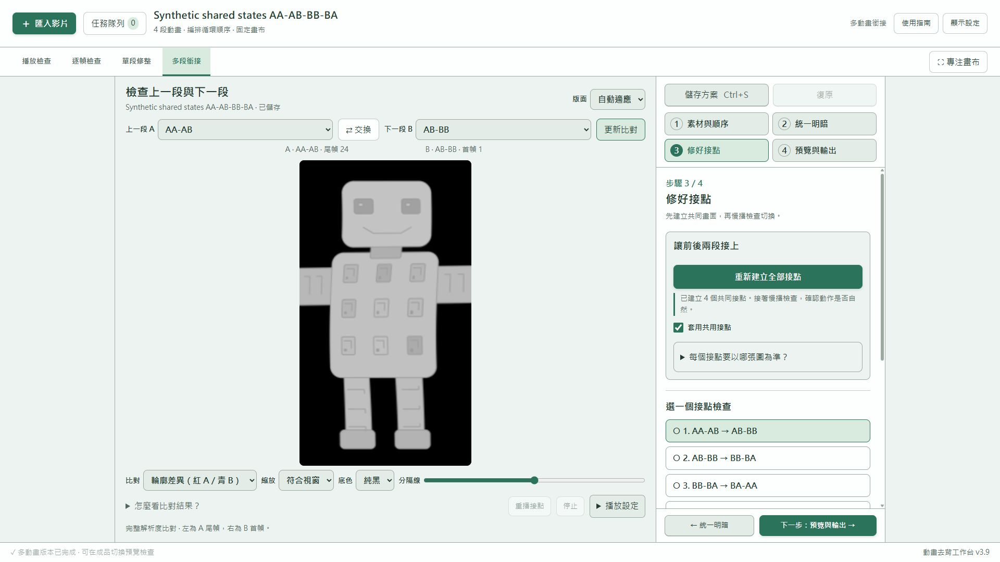
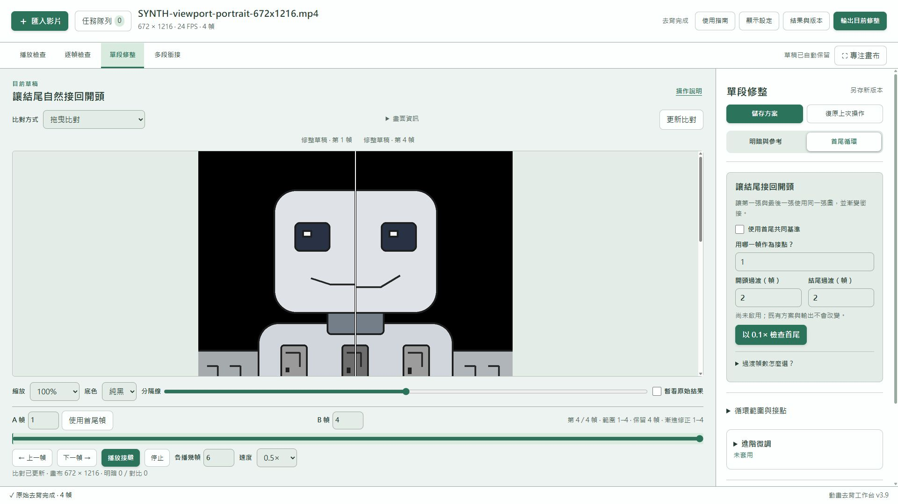

# 動畫去背工作臺：新手教學

本教學對照 v3.9 介面。先用一支短片完成「去背 → 檢查 → 輸出」，成功後再加入多段素材。

[回到 README](../README.md) · [下載發布版](https://github.com/wen880225/animation-workbench/releases/latest) · [完整使用說明](../使用說明.txt) · [依賴與限制](../依賴與限制.txt)

## 1. 先確認你需要準備什麼

這是 **Windows 原始碼套件，並非免安裝 EXE**。工作臺提供操作介面與修整功能，影片去背交由本機 ComfyUI 執行。

| 必需項目 | 用途與準備方式 |
| --- | --- |
| Windows x64 | 此分享版的目標平台；使用可寫入的資料夾。 |
| Python 3.12 x64 | 安裝時保留 Python Launcher（`py`）；安裝腳本會建立工具專用的 `.venv`。 |
| FFmpeg 與 FFprobe | 拆解影片及輸出 WebM；需要 `libvpx-vp9` 編碼器與解碼器。 |
| 本機 ComfyUI | 必須包含隨附 `qwen_original.json` 固定工作流所需的節點，並另行備妥相容模型。 |
| 磁碟空間 | 會保存影片、拆幀、透明 PNG 及每次另存版本；先用短片估計用量。 |

Python 可從 [Python Windows 官方下載頁](https://www.python.org/downloads/windows/) 取得；FFmpeg 請從 [FFmpeg 官方下載入口](https://ffmpeg.org/download.html) 選擇 Windows 套件；ComfyUI 請參考 [ComfyUI 官方專案](https://github.com/Comfy-Org/ComfyUI)。

**已安裝 ComfyUI，不代表所需工作流已能執行。** 目前工作流指定的模型名稱為：

| 模型選單 | 所需檔名 | 放入 ComfyUI 的資料夾 |
| --- | --- | --- |
| UNETLoader | `qwen_image_2.1_int8_convrot.safetensors` | `models/diffusion_models` |
| CLIPLoader | `qwen3vl_8b_int8_convrot.safetensors` | `models/text_encoders` |
| VAELoader | `qwen_image_2.1_vae_bf16.safetensors` | `models/vae` |

模型下載與放置位置請依 [Comfy-Org 官方模型文件](https://huggingface.co/Comfy-Org/Qwen-Image-2.1/blob/main/README.md)操作；模型不包含在分享套件中。不要把不相容模型重新命名來湊檔名。

完整節點清單見[依賴與限制](../依賴與限制.txt)。`QwenImage21Cache`／`TextEncodeQwenImage21`、`SaveImageAdvanced`、`ComfySwitchNode` 已可在 ComfyUI 官方本體找到，對應來源為 [Qwen 節點](https://github.com/Comfy-Org/ComfyUI/blob/master/comfy_extras/nodes_qwen.py)、[圖片節點](https://github.com/Comfy-Org/ComfyUI/blob/master/comfy_extras/nodes_images.py)、[邏輯節點](https://github.com/Comfy-Org/ComfyUI/blob/master/comfy_extras/nodes_logic.py)。若環境檢查顯示缺少，請將 ComfyUI 更新到包含這些節點的版本並重新啟動，再檢查一次；本教學不指定尚未驗證的最低版本。只執行工作臺的 `setup.cmd` 不會補齊 ComfyUI 環境。

隨附工作流為 API 格式、節點編號固定，不是可任意替換工作流的匯入器。顯示卡、VRAM 與 RAM 需求取決於 ComfyUI 模型和設定，目前沒有已驗證的統一最低規格。

**工作臺的 MIT 授權不涵蓋模型。** Qwen Image 2.1 的官方授權限非商業研究／評估，商業使用需另向官方取得授權；模型使用條款和輸出素材權利要分別確認。使用前請閱讀 [Qwen 官方授權](https://huggingface.co/Qwen/Qwen-Image-2.1/blob/main/LICENSE)與[第三方說明](../THIRD_PARTY.md)。

## 2. 第一次安裝與啟動

1. 在[發布頁](https://github.com/wen880225/animation-workbench/releases/latest)的 Assets 下載 `AnimationWorkbench_v3.9_source*.zip`，**完整解壓縮**到例如 `D:\AnimationWorkbench`。進入可看見 `setup.cmd` 的資料夾；不要直接在 ZIP 內執行，也不要放在唯讀資料夾。
2. 安裝 **Python 3.12 x64**，保留 Python Launcher。雙擊 `第一次安裝.cmd`，或同內容的 `setup.cmd`。此步需要網路，會在 `.venv` 安裝 NumPy、Pillow、SciPy 與 OpenCV；確切版本見 [requirements.txt](../requirements.txt)。看到安裝完成後再繼續。
3. 安裝 FFmpeg／FFprobe。可將它們加入 Windows 的 PATH，或把完整 FFmpeg 套件的 `bin` 內容放到 `D:\AnimationWorkbench\tools\ffmpeg\bin`。若下載的是 shared 版，相關 DLL 也必須保留，不能只複製兩個 EXE。
4. 啟動你已備妥模型與節點的 ComfyUI。工作臺預設連線到 `http://127.0.0.1:8188`；若你的 ComfyUI 使用其他本機埠號，稍後在介面修改。
5. 雙擊 `啟動工具.cmd`，或 `start.cmd`。在瀏覽器開啟 [本機工作臺](http://127.0.0.1:8767)，並確認右下角顯示 **v3.9**。
6. 按左上角 **「＋ 匯入影片」**，展開 **「模型設定與環境檢查」**，確認 ComfyUI 位址，再按 **「檢查環境」**。依畫面訊息補齊模型、節點或 FFmpeg，再重新檢查。

環境檢查通過後，仍要完成下一節的短片試跑，才能確認模型實際執行與成品是否符合需求。安裝腳本不會代為安裝 ComfyUI、模型、FFmpeg 或顯示卡驅動。此版本只支援本機 ComfyUI（`localhost`／`127.0.0.1`），未提供多人登入服務。

## 3. 先用短片跑通一次，再批次處理

### 第一次去背

1. 準備一支容易判斷輪廓的短片，按 **「＋ 匯入影片」→「選擇影片…」**，或把影片拖進虛線框。
2. 在 **「套用到本次加入的影片」** 選 **「每支先試跑，之後逐一確認」**。介面預設是整段去背，第一次使用請主動改成試跑。
3. 展開 **「幀範圍與輸出設定」**。初次先讓 FPS 留白，起始幀保留 1；試跑預設連續 48 幀，也可改為你的一個短循環長度。幀就是動畫中的一張圖片。
4. 按 **「加入隊列並開始」**，等待試跑完成。從 **「任務隊列」** 按 **「檢查素材」** 開啟結果。
5. 在 **「播放檢查」** 看正常速度與慢速播放；再到 **「逐幀檢查」** 放大看邊緣、透明區和細節。檢查時切換深淺底色，容易發現漏去背或邊緣殘留。
6. 效果可接受後，按 **「確認效果，排入全片去背」**。若隊列已暫停，再按隊列上方的開始／繼續按鈕。若效果不合適，先調查模型與來源，不要直接送入大量長片。

「僅加入隊列」可先排好素材；隊列原本正在執行時，新任務仍會接在後面。暫停會保留已完成影格，但已送給 ComfyUI 的請求可能繼續完成。重新啟動工作臺後，需要手動繼續隊列。

### 一次匯入多支影片

短片成功後，同一個 **「選擇影片…」** 可多選，也可分次追加，一次最多 100 支。支援 MP4、MOV、MKV、WebM、AVI、M4V、OGV、GIF，實際能否解碼仍取決於 FFmpeg。

本次加入的影片共用幀範圍與模型設定；FPS 留白則各自沿用來源 FPS。改 FPS 也會改變幀編號。單支匯入或處理失敗不會阻擋其他有效影片；先閱讀該項原因再重試。所有輸出均無音軌。

## 4. 看懂工作區與預覽縮放

| 分頁 | 何時使用 |
| --- | --- |
| 播放檢查 | 播放試跑、原去背結果或已輸出的修整版本。 |
| 逐幀檢查 | 檢查個別影格、輪廓與細節。 |
| 單段修整 | 調整一段動畫的明暗、參考圖或首尾循環。 |
| 多段銜接 | 將多段動畫排成循環，修接點並輸出整組。 |

字太小時，按 **「顯示設定」→「大字 · 18」**。需要更多預覽空間時，可按 **「專注畫布」**，完成後按 **「返回設定欄」**。

**單段預覽縮放：** v3.9 的單段預覽使用左側可用空間。「縮放」選 **「符合視窗」** 時，應按圖片比例完整顯示；選 **100%／200%** 時則保持指定倍率，超出可用空間才需捲動。這些設定只改你看到的大小，不會改變輸出解析度。若更新後仍看到舊的狹窄畫布或縮放異常，請先確認啟動的資料夾與版本，依排錯章節重啟後端，再重新整理頁面。

底色、遊戲背景、配色、介面字級與預覽縮放都不會寫進輸出。多段成品預覽可能為節省記憶體而縮小；要核對完整解析度，請按 **「開啟資料夾」** 看實際 PNG。

## 5. 單段修整：四個動作完成一段循環

### ① 開啟素材，選擇修整項目

開啟已完成去背的素材，切到 **「單段修整」**。右側有 **「明暗與參考」** 與 **「首尾循環」**。依需要使用其中一項或兩項；切換項目會保留設定。

單段修整讀取原始去背 PNG。即使你在「播放檢查」選了某個修整版本，也不會自動改成以該版本繼續加工。

### ② 調明暗，或設定首尾循環

**只需要明暗：** 在「明暗與參考」調整「中間調明暗」與「對比」，0 代表原圖。按 **「用自己的圖片比明暗」** 可載入 PNG／JPG／WebP，左側看參考圖、右側看目前結果；按 **「返回調整前後」** 可比較同一影格。參考圖只供比對，不會加入成品，重新開頁面後需再選。

**需要循環：** 選「首尾循環」，先在「循環範圍與接點」確認要保留的起幀與尾幀。若使用「尋找較佳接點」，採用候選會縮短保留範圍，分數仍需用播放確認。

要讓第一張和最後一張共用一張圖，可勾選 **「使用首尾共同基準」**，設定 **「用哪一幀作為接點？」**，再設定開頭與結尾過渡。先試每端 6–12 幀；短片不足時要縮短。保留範圍至少 4 幀、每端至少 2 幀，兩端過渡不能重疊。

### ③ 慢播與正常速度都看一次

按 **「以 0.1× 檢查首尾」**，再把速度改成 **1×** 檢查節奏。首尾共用基準會向片段內逐漸減少修正；端點像素相同，仍可能出現停頓、速度改變或扭曲。

「播放接縫」只反覆播放尾部接頭部的小片段；短播再次開始時，會另外跳回其起點，請分清楚它與原本的首尾接點。進階微調用於小幅位置或輪廓修正；收起進階區不會停用已套用設定。

### ④ 儲存方案，再輸出與核對

按 **「儲存方案」** 保留設定。接著按 **「輸出目前修整」**，核對範圍與設定，再按 **「輸出 PNG ＋透明 WebM」**。等待完成後，到 **「結果與版本」** 播放新版本，也可按 **「核對輸出首尾」** 檢查實際成品 PNG。

「暫看原始結果」只暫停預覽修正，輸出仍採用目前方案設定。修整成品另存新版本，原始去背 PNG 保留。

## 6. 多段銜接：跟著介面四步走

先準備至少兩段已完成去背的動畫，且畫布寬高相同。每組最多 16 段；工具不會為了加入專案而自動縮放素材。若要使用共用接點，每段至少保留 4 幀。

### 第一步：素材與順序

1. 切到 **「多段銜接」**，展開 **「表情組：開啟或新增」**，輸入例如「機器人動作循環」，按 **「新增」**。
2. 在 **「選擇已去背的動畫」** 選原去背任務或已輸出的修整版本，按 **「加入這段動畫」**。若剛完成的素材不在清單，按 **「更新來源」**。
3. 依序加入其餘動畫，用 **↑／↓** 排好順序。最後一段會接回第一段；例如加入「待機、揮手、收手」三段，播放為「待機 → 揮手 → 收手 → 回到待機」。每個加入的來源版本都有自己的幀數與 FPS。
4. 按 **「儲存方案」**，再到下一步。排序或移除只修改方案，不會刪除來源素材。

新組採每段一次的完整循環。若載入的舊方案使用自訂重複或部分路線，建立共用接點前需按 **「改成每段一次循環」**。

### 第二步：統一明暗

若各段明暗已一致，可直接往下。需要處理時，在 **「以哪一段的明暗為準？」** 選基準，再按 **「統一整組明暗」**。

查看 **「各段調整結果」** 的誤差與警告，並實際比對各接點。想再調整整體亮度，可展開 **「自行調亮、調暗」**。這項功能為各段估計固定曲線，無法保證消除來源的逐幀閃爍，也不能修復局部髒污、缺線或模型變形。

更換基準後需重新按「統一整組明暗」。修改來源、保留範圍或單段明暗，也需要重新統一。

### 第三步：修好接點

1. 確認順序與明暗已定，再按 **「建立全部共用接點」**，查看狀態並確認 **「套用共用接點」** 已啟用。
2. 預設每個接點採用下一段的首幀作為共同畫面。需要改用上一段尾幀時，展開 **「每個接點要以哪張圖為準？」** 修改，然後重新建立。
3. 在 **「選一個接點檢查」** 選接點，按 **「0.1× 慢播這個接點」**。再展開左側 **「播放設定」**，速度選 **1×**，按 **「依設定播放」**。
4. 需要調長短時，在 **「調整哪一段？」** 選 A（上一段）或 B（下一段），核對下方檔名，再調整該段的開頭與結尾過渡幀數。每端至少 2 幀，兩端不能重疊。
5. 逐一查看所有相鄰接點，包含最後一段回到第一段。

每個接點保存各自的共同畫面。它能讓前段尾圖和後段首圖相同，但**不能保證相鄰動作方向、速度或節奏自然**。大幅姿勢差、遮擋、細節新增或消失，仍可能產生扭曲。

修改來源、範圍、明暗、基礎變形或順序後，需重建共用接點，或先停用舊接點；只修改過渡幀數可沿用快照，但仍要重新慢播。看到「舊預覽／正在更新／更新失敗」時，等更新成功再判斷畫面。

### 第四步：預覽與輸出

1. 按 **「儲存方案」**，進入 **「預覽與輸出」**，按 **「輸出整組動畫」**，等待輸出完成。
2. 在左側選擇剛完成的 **「成品版本」**，按 **「載入成品」**。這裡會讀取實際輸出的 PNG 與保存的順序。
3. 用 **1×** 與 **0.1×** 播放，檢查循環與切換。**「成品接點驗證」** 可查看實際端點 PNG 是否相同；驗證相同仍需目視確認動作。
4. 按 **「開啟資料夾」** 取得各段 PNG、WebM、方案及整組 `manifest`。

點選表情按鈕會先播完目前片段，再接所選片段的第一幀，並非任意影格立即切換。後續修改草稿不會更新舊成品；請重新輸出，再載入新版本。`manifest` 是輸出資訊，不是遊戲引擎的動畫切換程式。

## 7. 儲存、輸出與備份差在哪裡？

| 操作／資料 | 保存什麼 | 仍需注意 |
| --- | --- | --- |
| 單段瀏覽器草稿 | 目前修整設定 | 清除網站資料、換瀏覽器、網址或埠號，可能看不到；參考圖不隨草稿保存。 |
| 儲存方案 | 可再次載入的修整或表情組設定 | 不會產生新動畫，也不是所有來源圖的完整備份。 |
| 輸出 | 這次設定產生的 PNG、WebM 與相關記錄 | 輸出完成後再載入該版本核對。 |
| 完整備份 | 來源與編輯所需資料一起複製保存 | 等處理結束後再備份，避免只複製到部分檔案。 |

以 `D:\AnimationWorkbench` 為例，常用檔案位置如下：

- `jobs\素材名稱\transparent_png`：原始去背 PNG。
- `jobs\素材名稱\output`：原去背 WebM 與記錄。
- `jobs\素材名稱\loop_edits`：單段修整的另存版本。
- `transition_projects\表情組\project.json`：多段方案；編輯時仍引用 `jobs` 裡的來源。
- `transition_projects\表情組\anchors`：共用接點快照，備份編輯方案時一併保留。
- `transition_projects\表情組\versions`：每次整組輸出與各段成品。

需要保留編輯能力時，請一起備份相關 `jobs` 與整個表情組資料夾。JSON 檔是設定或記錄，通常不必手動修改。重新分享工具時使用乾淨發布套件，避免包含自己的影片、任務、方案、日誌與截圖。

## 8. 常見問題與排錯

| 現象 | 先做什麼 |
| --- | --- |
| 安裝視窗說找不到 `py` | 重新安裝 Python 3.12 x64 並保留 Launcher，再執行 `setup.cmd`。 |
| 找不到 NumPy／Pillow／SciPy／OpenCV | 重跑 `setup.cmd`，檢查網路及視窗中的安裝錯誤；不要只更新系統的全域套件。 |
| 找不到 `ffmpeg`／`ffprobe`，或 WebM 編碼失敗 | 檢查 PATH 或 `tools\ffmpeg\bin`；確認完整 DLL 及 `libvpx-vp9` 支援。 |
| 無法連線 ComfyUI | 先確認 ComfyUI 已啟動，再核對「模型設定與環境檢查」的位址；預設為 `http://127.0.0.1:8188`。 |
| 缺模型或節點 | 依「檢查環境」的實際缺項核對[依賴清單](../依賴與限制.txt)。備妥相容工作流環境後重新檢查；不要僅重新命名模型。 |
| 工作臺開不起來 | 使用 `啟動工具.cmd` 啟動，確認開啟 `http://127.0.0.1:8767`。若埠號被占用，依下方重啟流程處理。 |
| 更新後仍是舊版、缺按鈕或縮放不對 | 確認啟動資料夾正確。後端程式更新需要重啟服務，單純重新整理頁面不足；重啟後確認右下角 v3.9。 |
| 找不到剛完成的多段來源 | 在「素材與順序」按「更新來源」。已刪除的任務需移除失效來源再加入，新任務不會只靠同名自動替換。 |
| 按了儲存卻找不到新影片 | 「儲存方案」只保存設定；請執行單段或多段的輸出流程。 |
| 輸出失敗、提示越界或來源改變 | 先讀取「結果與版本」或輸出區的錯誤；修正過大的變形／越界，確認來源沒有被移動或改寫，必要時重建接點，再另存新版本。不要把部分候選檔當成已完成成品。 |
| 成品預覽無法載入，提示幀數或記憶體 | 減少保留幀數或拆成較小的組；輸出原尺寸 PNG 不會因預覽縮小而被改寫。 |
| WebM 在其他播放器顯示底色 | 有些播放器忽略 Alpha。先與工作臺及透明 PNG 對照，再確認使用的播放器或引擎支援透明 WebM。 |

### 8767 被舊版占用時，如何重新啟動？

先儲存方案，等待上傳、去背、輸出、局部對位與明暗校準完成，再雙擊 **`重新啟動工作台.cmd`**，或 `restart.cmd`。重啟時不要從其他分頁開始新處理。

工具會核對埠號、程序及資料夾；若仍在處理、狀態不明，或埠號由其他程式／另一份工作臺使用，可能拒絕重啟。請依提示處理。關閉瀏覽器不等於關閉背景服務，也不要在輸出中強制終止服務，或同時啟動兩份工具處理同一份 `jobs`。

重新開頁後確認 **v3.9**。若只有介面檔更新，可重新整理；只要更新了後端，就需要重啟。

## 9. 第一次使用完成檢查

- [ ] 環境檢查完成，且一支短片已實際試跑成功。
- [ ] 在深淺底色、正常速度和慢速下檢查透明邊緣與動作。
- [ ] 已理解「儲存方案」與「輸出」的差別。
- [ ] 已輸出並載入實際成品，檢查接點與完整循環。
- [ ] 已找到 PNG 與 WebM 的資料夾，並保存必要來源與方案。

更多進階對位、選區、變形與輸出限制，請看[完整使用說明](../使用說明.txt)。工作臺程式碼採 [MIT License](../LICENSE)；模型與其他第三方依賴依各自條款使用，詳見[依賴與限制](../依賴與限制.txt)。
