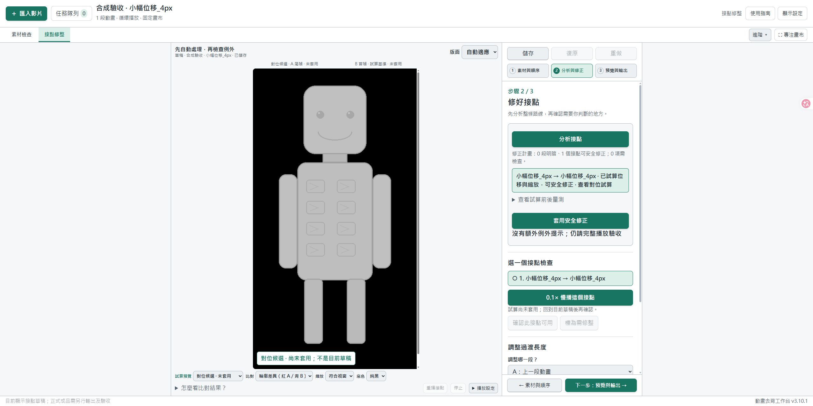

# v3.10.1 接點對位修正與驗收

本機修正版，2026-10-08。尚未發布 GitHub Release 或產生新版分享 ZIP。

## 修正的問題

原先先以未對位的像素差異決定能否修正，才進入共同接點過渡。細線只位移一點，就可能同時放大輪廓、細節與動作差分，提早變成「需要檢查」。這不是模型判定，也不代表素材無法修好。

新版在原本的「分析接點」流程中先試算受限的平移／等比例縮放，再檢查剩下的內容差異及所有受影響的過渡幀。符合條件後仍由同一個「套用安全修正」套用，不增加第二套自動修正入口。

對通過驗證的幾何候選，保存每幀的對位參數；預覽與輸出使用同一個幾何過渡計算，避免先搬移、再以光流重新扭曲。單段循環和多段銜接都走這個共同流程。

## 怎麼用

1. 保存目前工作，等去背／輸出結束，暫停隊列，再執行「重新啟動工作台.cmd」。確認頁尾為 v3.10.1；後端更新不能只靠重新整理。
2. 開啟接點修整專案，按「分析接點」。舊計畫需要重算。
3. 點候選列查看「對位前試算」與「對位候選」。畫面標示「未套用」時，沒有修改草稿，也不能標記驗收通過。
4. 有可安全修正項目時，按「套用安全修正」。一批操作可一次復原／重做。
5. 返回草稿，以 0.1× 及正常速度播放；再預覽完整路線、輸出並檢查當次成品。

若仍需檢查，展開量測可區分首尾幀與過渡中途的失敗原因，不再只得到「超出保守範圍」。局部非剛性對位候選只供檢查，不會直接套用。缺線、新物件、貼邊裁切或較大的動作差異仍需要人工判斷。

## 資料相容性

- 原始 PNG 不改寫，既有手動修正不默默覆蓋。
- 舊共同接點格式繼續使用舊渲染規則；新幾何過渡使用 schema 3，保存每幀參數與來源綁定。
- 修改來源、範圍、明暗、幾何、路線或新幾何過渡的幀數後，計算失效，需重新分析。候選預覽也綁定當次計畫。
- 前端要求相符的後端功能版本，防止舊服務忽略新參數卻宣稱已保存或已輸出。
- 這不是去閃爍、補畫或語義 AI，也不保證所有生成動畫都能自動接順。

## 驗收紀錄

本次只使用程式繪製的中性機器人、線條圖與合成缺損，未使用使用者素材。

| 驗收 | 結果 |
| --- | --- |
| 接點、明暗、歷史來源、原有渲染等 10 模組 | 97 項通過 |
| 幾何修正專項 | 7 項通過 |
| 獨立正例／反例與輸出一致性 | 17 項通過 |
| 啟動器版本／服務核對 | 8 項通過 |
| 前端接點、播放、過期來源等 7 支 Node 測試 | 全部通過 |
| Edge 實際操作：4 px 位移、1% 縮放 | 分析列為可修正，套用成功 |
| 候選與草稿隔離、整批復原／重做、改過渡幀數再分析 | 通過 |
| Edge 輸出 24 幀、480×864 PNG 與透明 WebM | 完成；首尾 PNG 完全相同，過渡外幀不變；WebM Alpha 最大誤差 1／255 |
| Edge 新增內容反例 | 1 項需檢查，套用停用，列出具體殘差原因 |
| 72 張合成來源 PNG 的 SHA-256 | 套用與輸出前後全部不變 |
| 乾淨分享包檢查 | 78 檔（含 SHA256.json），CRC／SHA-256／UTF-8／allowlist 通過；未寫 ZIP |

獨立驗收包含：1–4 px 位移、1% 縮放、連續子像素位移、單段循環、多段只修選中接點、預覽與實際輸出 PNG 一致、來源及過渡外影格不變、重複套用，以及改動／遺失參數後拒絕沿用。新增／缺少細節、細 Alpha 外延、中間突然多出物件、貼邊裁切及不可靠對應仍保留檢查。

測試命令（Python 3.12、已安裝依賴）：

```powershell
python -m unittest test_finish_plan test_boundary_routes test_transition_seams test_transition_tone test_transitions test_p0_artifact_state test_source_refresh test_alignment_integration test_loop_editor test_loop_closure -q
python -m unittest test_finish_alignment test_finish_registration_review test_launcher -q
node test_boundary_ui.cjs
node test_boundary_editor.cjs
node test_p0_media_state.cjs
node test_p0_single_playback.cjs
node test_p0_transition_state.cjs
node test_loop_ui_state.cjs
node test_source_refresh.cjs
python build_share.py --check
```

480×864、24 幀的合成 4 px 位移案例，分析約 11.2 秒（當時同時執行回歸測試）；10 個非零過渡幀全部驗證。這是該測試環境的單次觀察，不是其他尺寸／硬體的時間保證。幾何估計在分析時完成，播放和輸出不重新估計。


