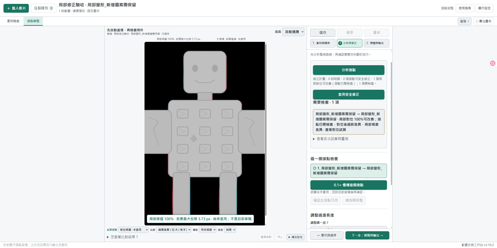

# v3.10.2 局部對位修正

本機修正版，2026-10-08。尚未發布 GitHub Release 或新版分享 ZIP。

## 修正範圍

v3.10.1 補上小幅整體平移／縮放，但局部對位仍可能因透明區的變形值被整體拒絕，也沒有替這項限制尋找較低修正強度。報告還會將整體候選殘差與局部候選失敗混在一起。

本版沿用既有局部對位：在可見角色及映射採樣區域量測位移，試算多個非零強度，檢查實際過渡影格。全畫布折返、擠壓、邊界與裁切保護仍保留。透明區不再冒充角色的位移量。

「套用安全修正」有兩種可能結果：

- **局部對位改善**：只保存局部變形參數，保留原內容與剩餘差異；接點仍待檢查。
- **共同接點修正**：只有更嚴格的端點及過渡驗證也通過，才建立共同基準；仍需播放確認動作。

這兩者使用原有按鈕，不新增一套 AI 或手動工作流。候選預覽仍標示「未套用」，不會改寫草稿或原 PNG。原有手動修正不會被自動覆寫。

## 操作

1. 保存工作、等待去背／輸出結束並暫停隊列，再執行「重新啟動工作台.cmd」。確認頁尾 v3.10.2。
2. 開啟原專案，重新「分析接點」。
3. 點候選查看對位前／後，確認採用強度與角色位移。
4. 如有局部改善或共同接點可套用，按「套用安全修正」。整批可復原。
5. 返回草稿，以 0.1× 和正常速度檢查，預覽整條路線後另存輸出。

詳細量測按算法分組。「尚未對上的輪廓像素」只是對應尚未重合，可能來自形變、正常動作或去背邊界；不是缺線／增生的語義判定。局部內容比例是局部量測視窗的結果，不代表整個角色有相同比例的錯誤。

## 驗收紀錄

只使用自製幾何圖形、機器人和合成形變；不使用使用者素材。未啟動 ComfyUI 或外部 AI/API。

- 最終後端回歸：129／129 通過（132.755 秒）。涵蓋對位、候選計畫、來源保護、過渡、輸出及原有流程。
- 獨立驗收：`python -m unittest test_finish_local_review -v`，10／10 通過（92.086 秒）。包含真實局部解算及 PNG／WebM 輸出，也用受控位移圖獨立檢查各安全條件。
- 啟動器：8／8 通過。前端 7 組回歸通過；最後明細顯示調整後，重跑編輯器、來源更新、狀態競爭 3 組與 JavaScript 語法檢查通過。
- 前景以外的大位移不再誤擋；100% 對角色不安全時，能選取較低的非零強度並真正套用。過渡中角色進入原透明區時，也按當幀前景重新檢查。
- 可見像素格的兩三角形與中心差分都檢查擠壓；交錯位移造成局部 Jacobian 0.4 的反例仍被 0.65 下限拒絕。
- 手動調整保護、混合批次的局部改善與共同接點、新增／缺失細輪廓、中間幀新增圖案、來源不變與候選未套用狀態皆有覆蓋。

Edge 實際操作兩組自製、左右貼邊且頭／軀幹反向形變的 480 × 720 動畫，各 24 幀、12 FPS：

| 驗收項目 | 貼邊局部形變 | 局部形變＋新增菱形 |
| --- | --- | --- |
| 內容差異比例（前 → 候選） | 7.89% → 1.33% | 8.21% → 1.65% |
| 採用範圍 | 局部幾何改善；仍待檢查 | 局部幾何改善；仍待檢查 |
| 實際強度／前景最大位移 | 100%／3.73 px | 100%／3.73 px |
| 實際 PNG 與同方案渲染逐像素相同 | 24／24 | 24／24 |
| 過渡修正前完全未改的影格 | 1–19 | 1–19 |
| 左右邊界 Alpha 最大差異 | 0 | 0 |
| WebM 回讀 Alpha 最大差異 | 1／255 | 1／255 |

兩組皆從介面套用、保存、輸出並自動載入固定 v001 成品；第一組也驗證整批復原／重做、0.1× 與完整草稿路線。48 張來源 PNG 的 SHA-256 保持不變。新增菱形在輸出尾幀仍有 448 個深色像素，首幀對應區域為 0；兩組都沒有建立共同端點或假裝首尾已完全相同。瀏覽器記錄無 warning／error。

下圖為實際候選畫面：可採用局部改善，但剩餘內容差異仍留待驗收。

分享套件以 `build_share.py --check` 檢查明確清單；測試素材、暫存工作目錄、專案、輸出、紀錄與使用者資料不會納入。此命令不寫出 ZIP。

## 限制

這次修正不保證任何生成動畫都能完全接順；沒有語義 AI、補畫或逐幀去閃爍。局部改善可以只完成部分工作，介面應保留剩餘待檢查項目。實際使用者素材是否改善，仍需在重啟後重新分析及播放確認。
