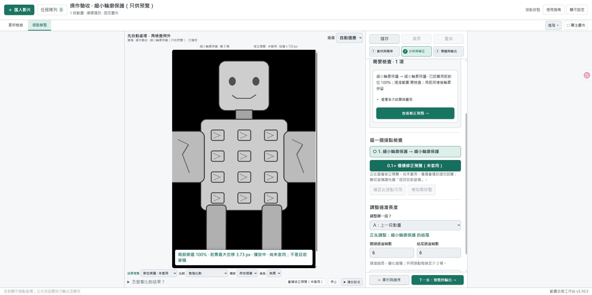

# v3.10.3 預覽操作與慢播修正

2026-10-08，本機修正版；尚未發布 GitHub Release 或新版分享 ZIP。

## 使用者看得到的改變

- 檢查結果是純資訊，不再整張暗藏點擊操作。下方改用獨立、實心底色的 **查看修正預覽 →** 按鈕；最小高度 48 px，具備鍵盤焦點及按壓回饋。
- 慢播跟隨畫布正在顯示的版本。按鈕分別寫明「慢播修正預覽（未套用）」、「慢播修正前試算（未套用）」或「慢播目前草稿」。
- 試算慢播使用同一候選的實際過渡影格，播放時持續標示未套用，停止後保留試算畫面。
- 只有明確選「返回目前草稿」才切回草稿。候選載入失敗、計畫過期、服務過舊時，會顯示錯誤，絕不偷偷改播草稿。
- 安全套用不可按時，仍可查看及慢播可用候選；這不代表已通過檢查。預覽不改寫草稿、不寫人工驗收紀錄，也不放寬安全門檻。

## 原因

舊版檢查卡的整段通知文字實際上是 button，但視覺樣式像通知。更關鍵的是，舊 `preparePreview()` 無條件清除候選檢視，再呼叫草稿播放，因此按慢播確實切换了版本。

本次將說明與動作拆開，增加唯讀的候選影格播放接口，沿用既有 renderer。前端播放請求綁定專案、接點、草稿修訂及試算前／後；較晚回來的旧回應不能覆蓋新的選擇。沒有改變對位算法、候選選擇、安全門檻、儲存方案或輸出格式。

## 驗收

只用自行繪製的機器人與透明幾何點，沒有讀取或測試使用者素材，也沒有外部模型／API 呼叫。

- 後端 50／50 通過：候選唯讀播放、計畫、局部對位、路線及啟動器相關回歸；79.553 秒。
- 新增 4 個後端測試：試算前／後影格與真實渲染相同、無套用或來源寫入、未知／過期／不符版本拒絕、渲染期間來源改變拒絕。
- 前端編輯器、播放狀態、來源更新與工作區 4 組回歸通過。包含 0.1× 時序、無草稿降級播放、停止／切換版本／更換接點／編輯／更换專案期間的 API 與圖片解碼競爭。
- Edge 實測「新增圖案」樣本的修正前／後慢播、停止保留候選，以及明確返回草稿。
- 另外繪製含細小半透明輪廓的反例，實際分析結果為 **0 個可安全套用、1 項待檢查**。確認「套用安全修正」保持禁用，而明確的查看按鈕和修正預覽慢播可用；慢播不會解鎖套用。
- 75 份測試資料（72 張來源 PNG 與 3 份專案）的 SHA-256 在預覽／慢播後保持不變。瀏覽器驗收期間未記錄 warning／error。測試素材、專案、原始資料與開發用腳本都不進入分享清單。

## 更新後

儲存工作並等處理任務結束，再執行「重新啟動工作台.cmd」，確認頁尾 **v3.10.3**。重新分析後，按檢查卡下方「查看修正預覽 →」，再按有明確對象名稱的慢播按鈕。

正式服務不由本輪自動重啟。此版本解決操作辨識與預覽切換問題，不宣稱已讓原本不安全的修正變成可套用。
