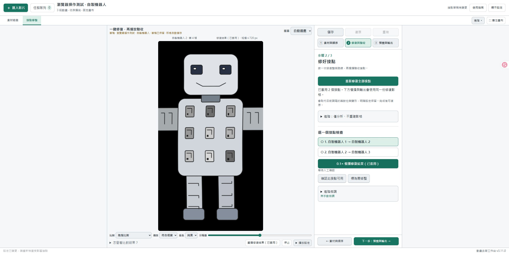

# v3.11 本地一鍵接縫修復（歷史實作紀錄）

目前發布版為 v3.12.0；新手請看[最新版教學](getting-started.zh-TW.md)及[模型安裝](model-setup.zh-TW.md)。以下中段保持原樣的描述只適用 v3.11；v3.12 會先穩定整段比例。

## 怎麼使用

1. 重啟工作台，再重新整理網頁，確認右下角 v3.11.0。關閉網頁本身不等於重啟服務。
2. 去背完成後，在「接點修整 → 素材與順序」加入素材。
3. 單段：一支動畫、選「順序循環」。多段：加入 A、B，排列順序；只要 A→B 就選「播完結束」，需 B→A 再選循環。三段以上依同樣規則。
4. 「修復與驗收 → 一鍵修復全部接點」。完成會直接套用並儲存；無須先分析或按安全套用。
5. 點「0.1× 慢播修復結果（已套用）」驗收。不滿意可復原；原始去背 PNG 保留。
6. 「預覽與輸出」播放完整路線，再另存版本。遊戲端可用透明 PNG 圖序；WebM 的 Alpha 支援依引擎而異。

每支至少 6 幀；同組畫布尺寸必須一致。每端自動重建約 0.25 秒（2–12 幀，最多片長三分之一），未涉及的中段保持原樣；總幀數及各段 FPS 不變。舊頭尾幾何對位會被本次重建取代，明暗設定保留。若明暗設定綁定過期，先更新明暗校準。修改來源、順序、保留區間或微調後須重新修復。

## 實作範圍

以過渡窗的兩個內側邊界為原圖，RIFE 4.25 估計共享中點光流；以時間與遮擋權重重建兩側過渡。RGB 使用預乘 Alpha，色彩與 Alpha 同步採樣。中间接點由同一張 RGBA 基準圖供兩側共用，而非只複製端點、保留跳動的鄰幀。

輸入只 pad 至模型倍數，輸出還原原尺寸，不縮小畫布。不用全局收窄來取得輪廓重疊。窄邊緣的新增空洞使用兩端皆觀察到的角色像素恢復覆蓋；這不是生成式補畫，也不保證重建原素材從未出現的部位。大幅遮擋、結構改變、快速動作仍可能扭曲或重影，須播放驗收；端點逐像素一致不等於所有動作已自然。沒有使用線上 API、LaMa 或 ProPainter。

修復 PNG 保存在表情組 `repairs/<版本>`，metadata 引用不可變版本。預覽、慢播及輸出讀同一份 PNG；快取缺失或損壞會報錯，不暗中換回原片。輸出仍另存版本。不要直接刪除仍被方案或歷史成品引用的 repairs 資料夾。

## 本地模型安裝

開發驗證電腦已安裝模型；這不代表下載者的電腦已配置。新電腦請依最新版模型安裝文件操作。

在另一台電腦需先準備 NVIDIA CUDA 可用的 PyTorch Python，且具備 NumPy、Pillow。工作台本體安裝步驟不會代裝 PyTorch。使用該環境執行：

```powershell
python setup_seam_model.py --python '完整路徑/python.exe'
```

腳本驗證 CUDA、下載官方 RIFE 4.25 約 23 MB 權重，驗證固定 SHA-256，寫入本機 repair_runtime.json。不修改 ComfyUI 環境。此路徑與模型不放入分享包。模型錯誤詳情見該次 repairs 資料夾的 model.log；失敗保留原草稿。

## 驗證（2026-10-08）

- 全部使用自製中性機器人；沒有拿使用者角色素材測試。
- RTX 3080 12 GB / CUDA PyTorch 2.10.0+cu130：672×1216、24 FPS，單段 24 幀循環約 5.6 秒，三段 A→B→C 的兩個接點約 8.1 秒，包含子程序載入。只是此合成案例測值。
- 單段與三段實際透明 WebM 輸出完成。96 張輸出 PNG 逐張與正式渲染結果完全一致，接點 RGBA 逐像素相同，原圖 hash 不變；WebM Alpha 最大誤差不超過 2/255。
- Edge 隔離工作台按鈕實測：一鍵修復、0.1× 慢播、復原／重做、儲存與重載。正式工作台未由開發程序重啟。
- 自動測試覆盖來源更新失效、快取損壞拒播、模型失敗不覆寫、邊緣覆蓋、單段／開放／閉合多段、過期 UI 回應與舊服務拒絕。

這是可試用的第一版本，不宣稱已在真實 H3 角色的所有動作與遮擋情況通過品質驗收。


