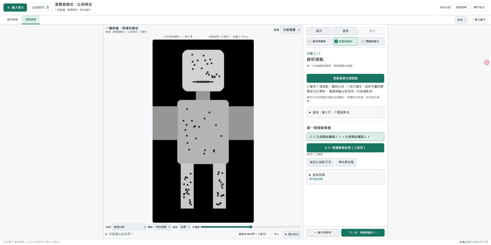

# v3.12 整段比例穩定

## 使用方式

重啟工作台服務並重新整理網頁，確認 v3.12.0。打開既有表情組，按原本的「一鍵修復全部接點」（已有修復時顯示「重新修復全部接點」）。現在會先量測整段比例、產生穩定後的影格，再建立接點過渡。舊成品不會自動改寫，需要重新修復並另存輸出。

沒有增加新的滑桿或操作步驟。單段循環與 A 尾→B 首共用流程；比較、慢播、整條路線播放與輸出都使用同一份修復 PNG。原解析度、FPS、幀數保持不變，原始 PNG 保留，可復原／重做。

進度會分別顯示「量測整段比例」「穩定整段比例」「本地模型重建接縫」。完成後顯示穩定段數。出現「比例待檢查」時，該段可能保留原比例，或僅成功對本段穩定而未能和其他表情共同校準；訊息會說明原因。接縫重建仍可完成，不能把「接點已套用」誤當作整段比例一定通過。

## 處理範圍與限制

- 直接追蹤每幀與參考圖的分散特徵，估計水平／垂直縮放；不連乘前一幀變換，避免累積漂移。小數精度計算與平滑曲線避免只在結尾收縮。
- 局部紋理與輪廓需要互相支持。特徵集中單一區域、追蹤長時間失效，或修正會破壞原本已對上的其他輪廓區域時，保留原比例並提示。
- 保留角色移動；目前以佔用輪廓中心估計縮放中心。嘴部、衣服、呼吸等局部動作不作為必須被壓平的目標。全身共同放大與有意的鏡頭推近仍可能難以區分，這版針對固定構圖的生成漂移，不是通用運鏡穩定器。
- 貼邊處保留法線方向覆蓋，允許沿邊方向的比例修正。完整反向採樣範圍檢查會拒絕新裁切；沒有使用裁切放大掩蓋空洞，也沒有生成看不到的身體部位。
- 多表情先嘗試共用路線第一段首幀作比例參考；無可靠對應時只做本段穩定，並提示跨段比例需檢查。大幅轉身／透視變化仍需視覺驗收。
- 沿用本地 OpenCV／SciPy 與已安裝 RIFE；沒有新增模型、雲端費用或修改 ComfyUI 環境。比只修頭尾多出逐幀分析與寫檔時間、磁碟占用。

## 合成驗證

全部為自製中性機器人／幾何素材，未使用使用者動畫。

- 0.5%、1%、2% 非線性緩慢漂移，並加入水平單軸變寬、局部嘴部變化、真實局部呼吸變形。
- 回歸測試：靜止輪廓內紋理膨脹、局部軀幹膨脹但頭部不動、側邊接觸附近的獨立細節裁切，以及貼邊手臂的沿邊比例修正。
- 672×1216、24 FPS、每段 32 幀：1% 單段循環與 A→B→C 三段實際 RIFE／透明 WebM 輸出完成。128 張實際輸出 PNG 與渲染逐像素相同；接點兩端相同，來源雜湊不變。
- 單段案例：固定頭部橫切線的 Alpha 加權寬度起伏由 2.7608 px 降至 0.1098 px。三段案例各自由 2.7608／1.4196／5.5725 px 降至 0.1255／0.0627／0.0902 px。這是已知合成漂移的量測，不是對所有 H3 素材的誤差保證。
- 獨立審查已以合成案例確認上述局部誤判及裁切問題修正。

本次發布包含原始碼分享 ZIP，模型與使用者資料不隨包散布。升級與模型安裝見[新手教學](getting-started.zh-TW.md)。

維護者已完成單表情循環實測並認可效果（主觀評價 95/100）；多表情實際素材測試尚未完成。這與上述合成驗證分開記錄。

## 瀏覽器驗收

一鍵修復完成後顯示整段穩定狀態，0.1 倍速播放維持「修復結果（已套用）」。

最終回歸：61 項後端測試通過；接點修復、共用編輯器與播放狀態前端測試通過。隔離服務 8792 的新啟動器 readiness 檢查為 READY。
